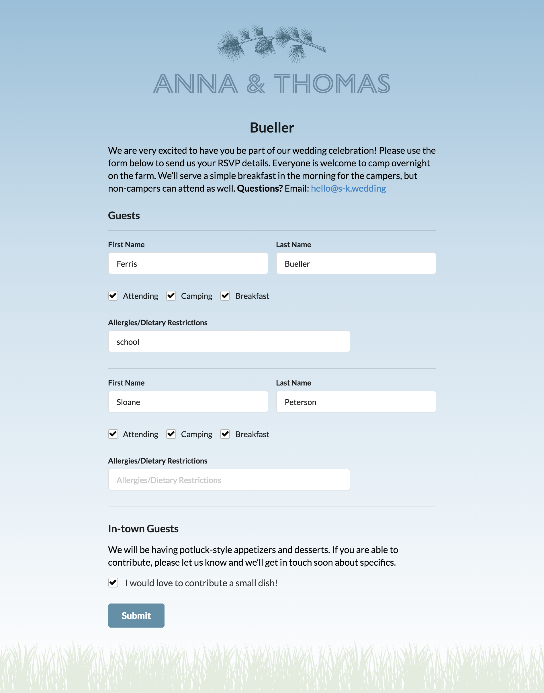

# sk-wedding

<p align="center"></div>

*sk-wedding* is a lightweight RSVP application that I built for my wedding to allow us easily get specific information from our guests and see it in a simple dashboard.

## Getting up and running

```sh
$ git clone https://github.com/tkilgour/sk-wedding.git # or clone your own fork
$ cd sk-wedding
$ npm install
$ npm start
```

The app should be running on [localhost:5000](http://localhost:5000/).
